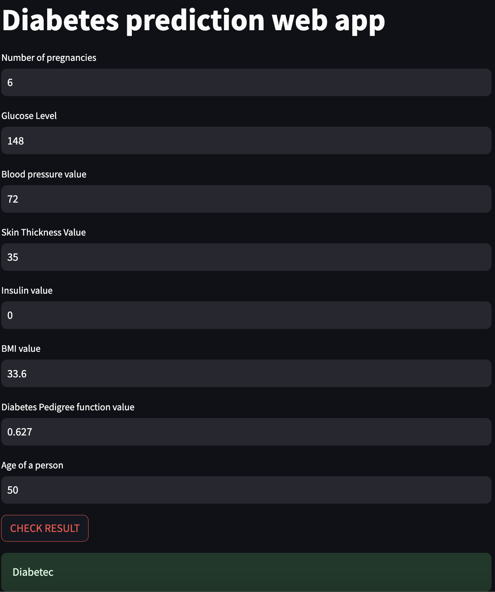
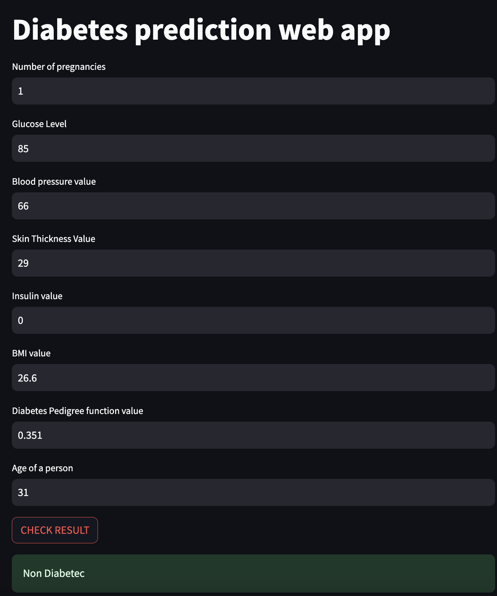

# SE

This is my Software Engineering projects for practical examinations.

## running the file

To run the python script run the following command

```bash
streamlit run filename.py
```

## Contributing

```

## Contributing

Pull requests are welcome. For major changes, please open an issue first
to discuss what you would like to change.

Please make sure to update tests as appropriate.
```

## Outputs

## Diabetes Prediction




## Movie Recommendation


